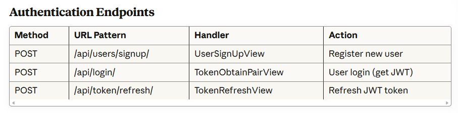
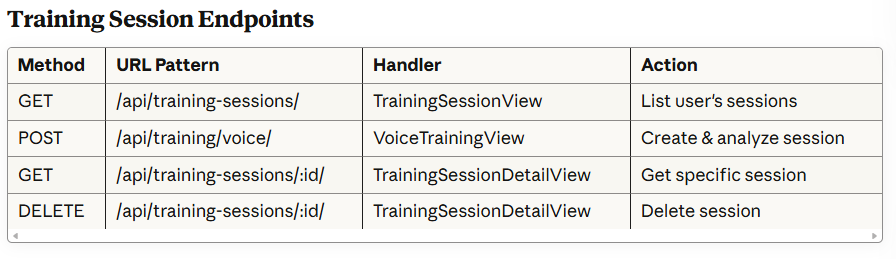
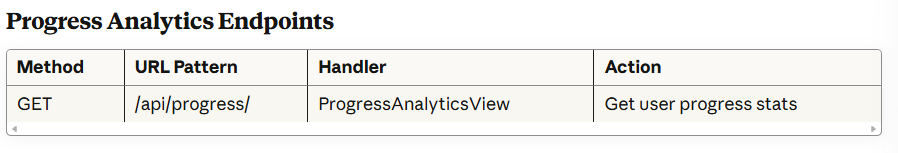
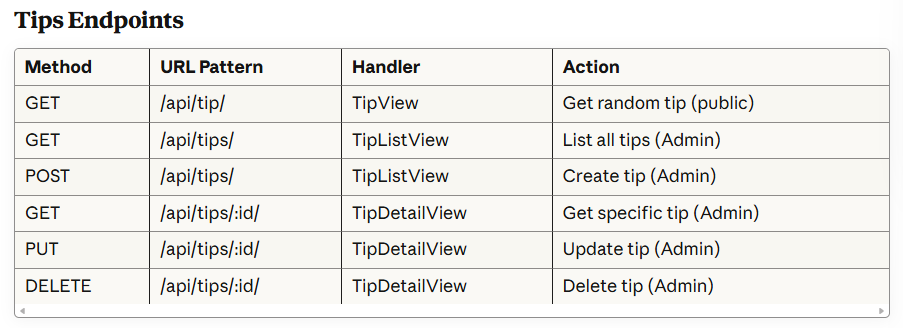
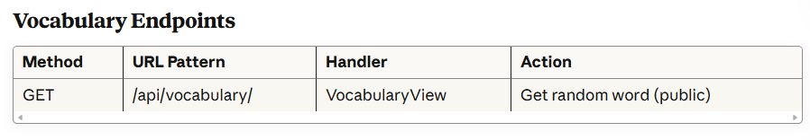

# SpeakEase Backend
## 💡 Project Name:
### SpeakEase

### 🎯 Project Description:
SpeakEase Backend is a Django REST Framework API that powers an AI-driven platform designed to help individuals improve their speaking fluency and communication skills. The backend handles user authentication, voice analysis, training session management, and progress tracking.

- Pronunciation accuracy
- Speaking confidence
- Communication skills

## Tech Stack

Python 3.11

Django 5.1

Django REST Framework

PostgreSQL

Simple JWT (Authentication)

AI/ML Libraries:

- Whisper (OpenAI) - Speech recognition.

- librosa - Audio analysis.

- pydub - Audio processing.

- NLTK - Natural language processing.

- transformers - Hugging Face models.

## Frontend Repo Link
https://github.com/Jnoox/SpeakEase-frontend

## 📊 ERD Relationships:

## 🔁 RESTful Routing Table:

## ✅ Full CRUD Implementation (2 models)

### UserProfile (User-Based CRUD):

Create: Automatically created during user signup.

Read: GET /api/profile/ - Users view their own profile.

Update: PUT /api/profile/ - Users update their full_name and age.

Delete: DELETE /api/profile/ - Users delete their entire account.

### Tip Model (Admin-Based CRUD):

Create: POST /api/tips/ - Admin creates new tips.

Read: GET /api/tips/ - Admin views all tips; GET /api/tip/ - Public gets random tip.

Update: PUT /api/tips/:id - Admin updates tip content.

Delete: DELETE /api/tips/:id - Admin deletes tips.

## 🎯 Key Features
### AI-Powered Voice Analysis:

Transcription: Uses Whisper AI to convert speech to text with high accuracy.

WPM Calculation: Measures speaking speed (words per minute).

Pronunciation Analysis: Detects mispronounced words.

Repetition Detection: Identifies frequently repeated words.

Pause Analysis: Calculates pause percentages in speech.

Scoring System: Provides overall performance score (0-100).

### Progress Tracking:

Automatic calculation of average, best, and worst scores.

Total training time tracking across all sessions.

Session history management with detailed analytics.

Real-time updates after each training session.

### Security Features

JWT-based authentication with access and refresh tokens.

Password hashing using Django's built-in security.

Protected API endpoints with permission classes.

CORS configuration for secure frontend access.

Admin-only routes for sensitive operations.

### Admin Panel Features:

Full CRUD operations on Tips model.

User management capabilities.

Session monitoring and analytics.

Content management for vocabulary and tips.

## 🧊 IceBox Features:
### Daily Conversation via Camera

#### Workflow:

Opens camera interface for the user.

Displays daily questions (e.g., “Describe yourself”).

Each question lasts 5 minutes (total 15 minutes per session).

AI facial analysis feedback includes:

Facial expressions.

Nervousness detection.

Eye contact and engagement.

Why: Visual feedback improves confidence and presentation skills.

### User Goals Page

#### Workflow:

Users can add personal speaking or confidence goals.

CRUD operations on goals: create, read, update, delete.

### AI Coach for Interview Training

#### Workflow:

Records user video answering interview questions.

AI analysis provides:

Pronunciation & speech analysis (existing voice module).

Facial expression & engagement feedback.

NLP feedback on answer clarity and structure.

Generates coaching report with improvement tips.
